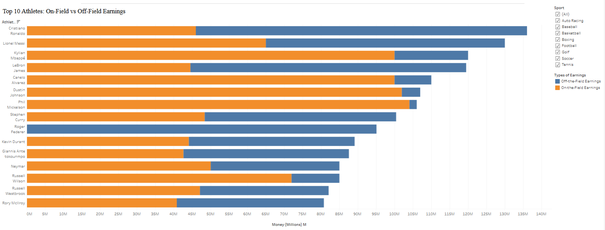
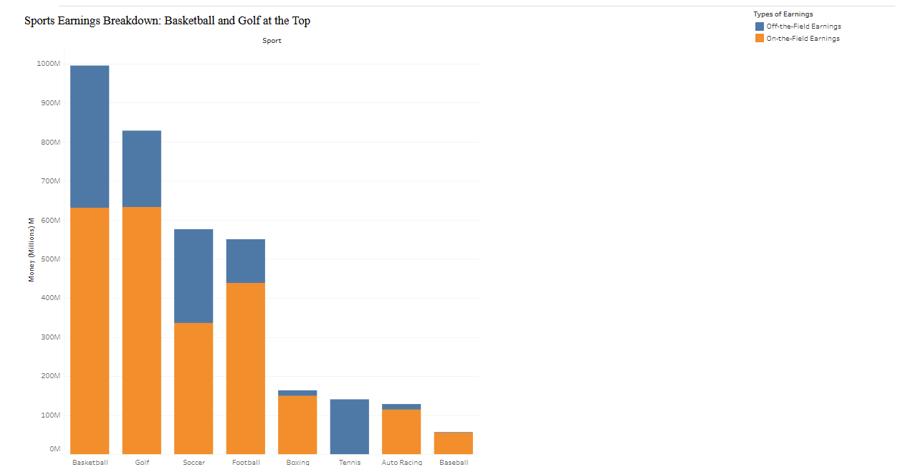
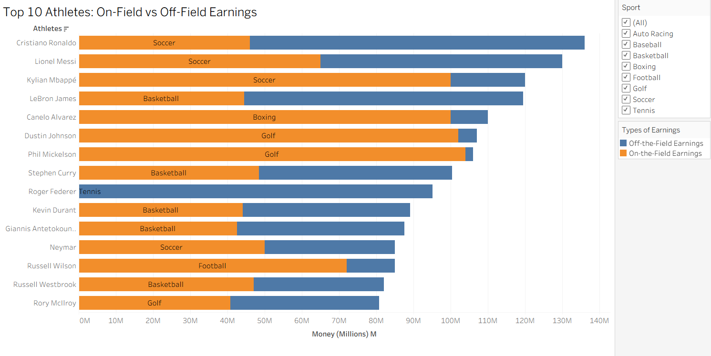

| [home page](https://cmustudent.github.io/tswd-portfolio-templates/) | [data viz examples](dataviz-examples) | [critique by design](critique-by-design) | [final project I](final-project-part-one) | [final project II](final-project-part-two) | [final project III](final-project-part-three) |

# Title
Exploring Data Critique and Redesign through Forbes Top 10 Highest Paid Athletes

## Step one: the visualization

[Original Forbes Visualization](https://www.forbes.com/lists/athletes/?sh=162054105b7e)

The data visualization shows a ranked list of the top 10 highest-paid athletes (The Forbes link shows all, but a top 10 snippet of this table has been the popular vis going around), including their total earnings, on-the-field earnings, and off-the-field earnings. I’m an avid sports watcher, and I use social media all the time for sports news, analysis, or just talking with my friends about it. This visualization is one I see every year, and I remember seeing the latest version on Instagram not long ago. Whenever I see it, I end up wondering more about it—how does it compare across all sports, and who makes more from on-field earnings versus off-field endorsements? That’s why I chose this one to critique and redesign. My goal is to break it down into three separate graphs that tell a clearer story, highlight more hidden details, and finally answer the questions I’ve always had when looking at it.

## Step two: the critique
The data visualization presents a ranked list of the top 10 highest-paid athletes. While the data itself is compelling, especially for audiences interested in sports, business, or celebrity culture, the way it is presented limits its effectiveness. The table format is visually flat and difficult to scan quickly. There is no visual hierarchy or design elements to guide the viewer’s attention, and the lack of source citation or a clear time frame makes it harder to assess the context and reliability of the data. It acts as a plain table, with no overarching story being told through it.

Going through the categories of usefulness, completeness, perceptibility, truthfulness, intuitiveness, aesthetics, and engagement, I’d say this is actually a pretty solid tool for critiquing the visualization. Starting with usefulness, the table is pretty effective for its audience. It communicates valuable information about the top-paid athletes and lays out all the numbers in a simple, straightforward way. For completeness, the visualization includes all the data points you need to understand the rankings, but it’s missing those story-driven elements that would really help highlight trends and deeper insights in the data.

Perceptibility is where it takes a hit. The table format works for its intended purpose and is easy enough to follow, but it doesn’t make hidden details pop out. A stacked bar chart, for example, would make those comparisons instantly clear and tell a bigger story. In terms of truthfulness and intuitiveness, though, it scores high. The numbers are accurate, coming directly from Forbes, and the table doesn’t mislead the audience. On top of that, it’s intuitive—everyone immediately understands the rankings and what the columns represent.

Aesthetics, however, are pretty weak. The table is bland, with no strong colors, no hierarchy, and nothing that visually draws you in. Finally, engagement is surprisingly high. Even though the original table itself is plain, I’ve seen it everywhere, especially because so many social media accounts redesign or repost it. Since those viral versions all trace back to this source, it’s clear that the visualization has strong engagement power, even if it’s not flashy on its own.

Overall, this table has strong data to work with, but very weak design. The simple use of a table is not visually appealing, and fails to capture the story driven elements that makes data viz so memorable. With a redesign to a new chart type, there can be further insight on hidden trends, and the data could better emphasize comparisons across athletes and sports, and create a more engaging experience for the audience.

## Step three: Plan
The critique process made me realize that while the table was accurate and engaging, it failed in perceptibility and storytelling. That directly shaped my redesign choices. For my redesign, I decided to break the table into two separate visualizations that highlight the parts of the data I was most curious about. The first graph shows the top 25 athletes ranked by their on-field and off-field earnings, using a stacked bar chart to make the differences between the two categories immediately clear. This not only keeps the rankings but also tells a deeper story about which athletes are earning more from endorsements versus competition.

The second graph zooms out to the team level, showing total earnings by sports. I wanted to highlight which sports generate the most money for their athletes and compare how much of that comes from on-field performance versus off-field deals. Together, the two visualizations answer questions the table couldn’t—like which athletes rely heavily on endorsements, and which sports create the highest earning power overall.

My plan was to take the orginal balnd and flat table,  and redesign it into visuals that are both easier to interpret and better at telling an overarching story with the intriguing data.
## Step four: Test the solution
In class, I had the opportunity to present my ideas and a quick sketch of my plan for this redesign. The central theme and structure of my visualization remained the same, but I gained valuable insight into how I could better communicate the story behind the data. My initial concept focused on ranking on-field and off-field earnings by athlete, offering a new dimension to the original table format. From the feedback I received, the core idea and sketch were easy to understand, and I was encouraged to move forward with the base design. However, several limitations were identified that helped me refine my approach and think more critically about the audience and context.

One of the most common pieces of feedback was about labeling. In my sketch, I hadn’t included the year the data was from, a simple but crucial detail that adds necessary context and credibility. Although my sketch didn’t include color, participants emphasized the importance of using contrasting colors to clearly differentiate on-field and off-field earnings. This feedback led me to explore the data from two perspectives, individual athlete and by sport type. As a result, I created two separate stacked bar charts to serve as the redesigned visualizations, allowing for more nuanced comparisons and a clearer narrative.

Another key point of discussion was the labeling of athletes and their associated sports within the athlete stacked bar graph. While some participants appreciated the added detail, others noted that the intended audience is likely familiar with these athletes, might find the extra labels distracting or cluttered. This helped me realize that simplifying the labels and focusing on clarity would better serve the visualization’s purpose. The feedback also helped me think more intentionally about who the visualization is for and how they would interact with it. Also, a final key critique was focused on the amount of athletes, as previously mentioned, I was shooting for a top 25, but it causes the lines to be blurred together if not expanded correctly, so I decided to make the lines bigger and use less athletes. Overall, this testing phase was instrumental in helping me expand and refine my design, ensuring that it communicates the data more effectively and resonates with the intended audience. It also gave me a clearer direction heading into the final build phase, where I can apply these insights to create a polished and purposeful visualization.

## Step five: build the solution

Taking into account all the information I got from my critique, I ended up with this version with two stacked bar graph, both showing onfield and off field earning, but by team and by athlete. 

Stacked-bar graph by Athlete: 

Stacked- bar graph by Sports Type:

When examining the two redesigned graphs, the added engagement and improved aesthetics are immediately noticeable, especially through the use of color. My primary goal in creating these visualizations was to introduce story-driven elements that were missing from the original table. In the graph comparing earnings by sport type, a clear narrative emerges: basketball and golf dominate in total earnings when compared to other sports. This visualization provides deeper insight into the data and reveals patterns that were not visible in the original format.

I chose orange and blue to represent on-field and off-field earnings, respectively. This color contrast effectively separates the two categories and enhances readability. Using these categories was crucial, particularly in the sport-type graph, as it highlights how athletes in different leagues are compensated. For example, NFL players tend to earn more on the field than soccer players, but when off-field earnings are included, soccer players surpass them in total income. This layered view of the data reveals nuances that a simple total revenue breakdown would miss. Similarly, the dominance of off-field earnings in tennis is striking—nearly all of the top athletes’ income comes from endorsements and sponsorships. These insights are made possible through the stacked bar format, which adds depth and clarity to the story.

For the athlete-focused graph, I expanded the scope to include the top 15 earners. I opted to remove labels from the bars to reduce visual clutter and make the chart easier to interpret. To illustrate the impact of this choice, I included a labeled version at the bottom of the section for comparison. This redesign again emphasizes storytelling and insight. For instance, Roger Federer earns nearly all his income off the field, while athletes like Canelo Álvarez and top golfers earn most of theirs on the field. Meanwhile, global icons like LeBron James, Lionel Messi, and Cristiano Ronaldo show a balanced mix of both. These patterns are far more visible and meaningful in the redesigned visualization than they ever were in the original table.

Overall, this project served as a valuable learning experience in both critiquing a data visualization and redesigning it with purpose. From the beginning, I was drawn to the athlete earnings table because of its high salience and relevance, but also because of its clear limitations. The original visualization lacked visual hierarchy, engagement, and clarity—making it a strong candidate for transformation. This gave me the opportunity to apply the critique-by-design method meaningfully, using Stephen Few’s Data Visualization Effectiveness Profile to identify specific areas for improvement.

Throughout the process, I focused on building a story-driven visualization that could reveal insights hidden in the original table. By converting the data into stacked bar charts, I was able to highlight the contrast between on-field and off-field earnings, both by individual athlete and by sport type. These visualizations not only improved aesthetics and readability, but also added analytical depth—showing patterns such as the dominance of off-field earnings in tennis or the balanced income streams of global icons like Messi and LeBron.

The in-class feedback session was especially helpful in refining my design. It pushed me to think more critically about labeling, color contrast, and audience expectations. I learned that small details, like including the year of the data or simplifying labels, can significantly impact how a visualization is interpreted. These insights guided my final redesign choices and helped me create visuals that are not only clearer but also more engaging and informative.

In the end, this project taught me how to move from critique to creation, using design thinking to turn missed opportunities into meaningful visual stories. It also prepared me for future work by reinforcing the importance of audience awareness, iterative feedback, and purposeful design decisions. 

Below is the graph with labels, a key point I mentioned with the feedback and my final design. While this is effective for a general audience, for the intended sports audience it becomes unnecessary labels that clutter the graph. I am curious which graph you like better, and it is definitely something to think about

## References

[Original Forbes Visualization](https://www.forbes.com/lists/athletes/?sh=162054105b7e)

The tool used for the visualizations was Tableau, with also the use of Tableau Public in publishing this visualization.

